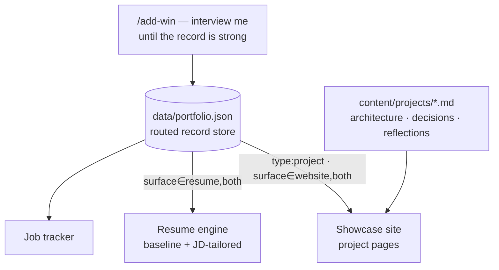

---
# This file is the long-form narrative for the `career-os` record in data/portfolio.json.
# Structured fields (title, stack, status, decisions) live in the JSON; this is the prose,
# diagrams, and reflections the project detail page renders. Pair them by `id`.
id: career-os
---

## What it is

Career OS is a personal system built on one idea: **capture a career win once, then let it
feed everything downstream** — a public project showcase, a baseline resume to download, and
resumes tailored to a specific job description. No more rebuilding a CV from a blank page for
every application.

## Architecture

There's a single source of truth — a structured record store — and three consumers read from
it. Each record is routed by metadata (`type`, `category`, `surface`) so the same capture can
surface on the website, in the resume, or both.

The split that makes this work: **structured, queryable fields live in JSON** (title, tags,
metrics, stack, short decision list) — that's what the resume engine scores and what the cards
render. **Long-form narrative lives in markdown** (this file) — multi-paragraph architecture
write-ups, the reasoning behind decisions, reflections, and diagrams. The build step
pre-renders the markdown to static HTML so the live site ships no runtime markdown library and
works offline.

## Decisions & trade-offs

- **One record store, routed by metadata** — capture a win once and let `surface`/`type`/
  `category` decide where it appears, instead of duplicating it across a "projects" file and an
  "achievements" file. The cost: every record carries routing fields.
- **JSON for structure, markdown for prose** — keeps the resume engine reading clean fields
  while project pages get real narrative and diagrams. The cost: two files per project to keep
  in sync.
- **Pre-render markdown at build time** — static HTML, offline-friendly, fast. The cost: a
  build step.

## Reflection

> _(Your voice — draft below, edit freely.)_

The hardest part wasn't the code; it was the **content model**. Deciding that a "project" (a
thing I built, with an architecture worth showing) is a different unit from a "win" (evidence
of how I lead, which belongs on a resume but not a showcase) is what made the whole system fall
into place. Once that line was clear, routing was just metadata.

What I'd watch next: whether the capture step stays cheap enough that I actually use it, and
whether tailored resumes come out genuinely better than a hand-edited one — that's the real
test of whether the structured layer was worth it.
