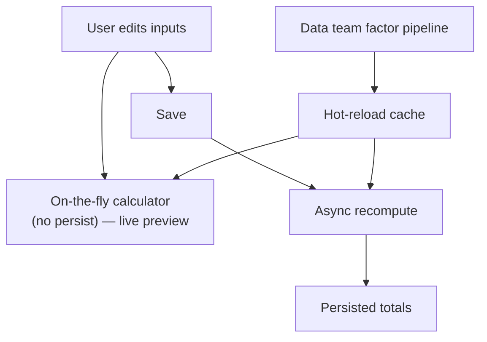

## What it is

The emissions feature evolved across a few phases — emissions varied per question, then per
question *and* year, then the data team owned a separate emission-factors pipeline and the
backend consumed those factors. This work belongs to that last phase.

With the data team owning factor processing, the app had to recompute asset emissions whenever
users edited inputs. The default path was **async recalculation on save** — which meant users
had to save *and then wait* just to see how their changes moved the total. This work kept that
path correct but stopped forcing the round-trip.

## Architecture

Two calculation paths, deliberately kept separate. The **async-on-save** path persists totals
that stay consistent with the data team's factor pipeline. A second **on-the-fly calculator**
runs without persisting, giving a live preview while the user is still editing. A **hot-reload
cache** lets upstream factor changes refresh downstream values without a restart or a cold-cache
penalty.

## Decisions & trade-offs

- **Separate the on-the-fly calculator from async-on-save** — users get an instant, accurate
  preview without committing, while persisted values stay authoritative. The cost is two
  calculation paths that have to agree.
- **Hot-reload cache for factors** — upstream factor changes propagate without a disruptive
  deploy or restart. The trade-off is the usual cache-invalidation complexity.

## Reflection

> _(Your voice — draft below, edit freely.)_

The win here is small in seconds but large in feel: roughly **~3 seconds saved per update**, but
more importantly the edit loop stops feeling like save-and-wait. Keeping the preview path
non-persisting was the call that made it safe — you can show a number instantly without ever
risking an inconsistent persisted total.

> _Note: the ~3s figure is carried from the Feb 2025 resume; pin down which exact phase
> generated it before leaning on it in an interview._
