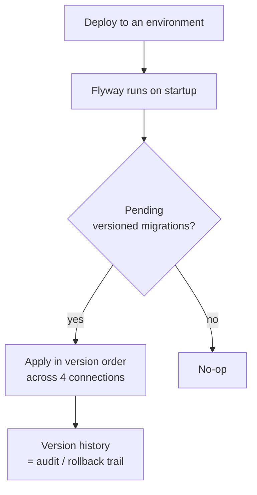

## What it is

Database schema and data changes were being applied by **manual patching** — error-prone,
inconsistent between environments, and a frequent source of deployment friction. This work made
DB updates reproducible, tied to deployments, and auditable, by rolling out **Flyway across all
4 DB connections** the codebase uses — **3 SQL databases + 1 MongoDB**.

## Architecture

Flyway started in **dev** and was rolled out progressively until it managed migrations across
every connection. Migrations follow Flyway's **versioned naming convention** so they're picked
up automatically by version order with no per-deploy human input, and they're wired into the
**deployment pipeline** to auto-run on every deploy to each environment.

## Decisions & trade-offs

- **Versioned naming + auto-run on every deploy** — promoting code to a new environment no
  longer needs a separate DB step; the migrations come along for the ride, and the version
  history doubles as an audit and rollback reference the team didn't have before. The trade-off
  is discipline: migrations have to be forward-safe and correctly ordered.
- **Rolled out from dev outward** — proving it in dev before touching production environments,
  rather than flipping everything at once.

## Reflection

> _(Your voice — draft below, edit freely.)_

The visible result is that **manual data patching effectively disappeared** across all four
connections, and "works on staging, broken in prod" incidents dropped. The quieter win is the
version history — having a complete, ordered trail of every DB change turned schema changes from
a risky manual ritual into something boring and repeatable, which is exactly what you want from
infrastructure.
