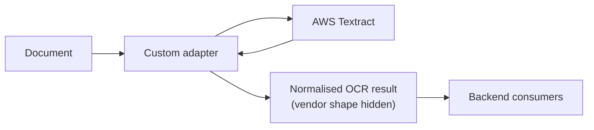

## What it is

We needed in-house structured extraction from documents, and there was no existing pattern for
how the backend would consume that output cleanly. The goal was to stand up a POC fast enough to
validate the approach end-to-end **and** design the integration surface the rest of the system
would rely on — delivered as a working MVP in about **one week**.

## Architecture

The MVP was built in **Python**, wrapping **AWS Textract** behind a **custom adapter**. The hard
part was never calling Textract — it was the integration question: how does the backend request
OCR, consume the response, and feed it downstream *without leaking Textract's response shape
everywhere*? The adapter interface was designed around exactly that constraint.

## Decisions & trade-offs

- **Wrap Textract behind a custom adapter** — the backend consumes a normalised OCR result and
  never couples to the vendor's response shape. The cost is an adapter layer to maintain, but it
  bought a clean contract and a swappable provider.
- **Later retired the in-house pipeline and outsourced OCR** — Textract didn't cover the
  languages we ultimately needed. That swap was made far easier by the adapter boundary.

## Reflection

> _(Your voice — draft below, edit freely.)_

This is the project I'm happy to tell honestly: the in-house pipeline is **no longer
maintained** — OCR is outsourced now because of language coverage Textract couldn't give us. But
the part worth talking about still stands. The adapter boundary meant replacing the OCR provider
was a contained change, not a rewrite — which is the whole point of designing the integration
surface deliberately, even for a one-week POC.
