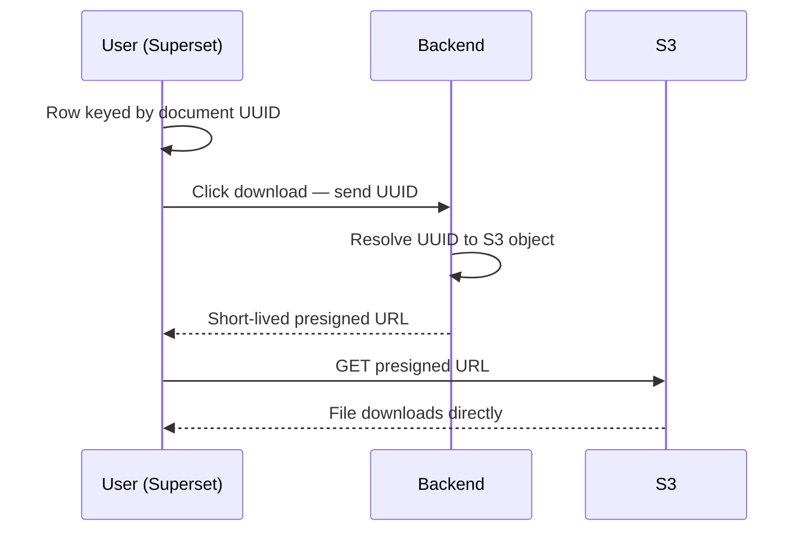

## What it is

We needed document-backed records to show up inside **Apache Superset** dashboards, and we
needed users to **download the underlying document** straight from the table — without exposing
raw S3 paths or making documents publicly addressable.

This is the full-stack flow that does it: a Superset row resolves to a working, time-limited
download for the document it represents, while the actual S3 location stays private behind the
backend.

## Architecture

The trick is that Superset never carries an S3 path — only a document **UUID**. The download
button trades that UUID for a short-lived presigned URL, and the browser pulls the file
**directly from S3**, so the heavy bytes never flow through the application server.

I built all three sides: the Superset data integration (records surfaced, keyed by UUID), the
UI download button, and the backend endpoint that resolves a UUID to a time-limited presigned
URL.

## Decisions & trade-offs

- **Key rows by UUID and presign server-side** — keeps real S3 paths private and makes every
  download link short-lived. The cost is an extra backend round-trip before the download starts.
- **Client downloads directly from S3** — the backend only ever hands out URLs, never proxies
  bytes, so it stays lightweight on the download path. The trade-off is a dependence on
  presigned-URL expiry being handled correctly.

## Reflection

> _(Your voice — draft below, edit freely.)_

The satisfying bit is how little the backend has to do: it's just a UUID-to-URL resolver. All
the security (private paths, expiry) and all the performance (direct S3 transfer) fall out of
that one shape, instead of routing every file through the app.

> _Gap to fill: scale numbers — # of documents indexed in Superset, # of dashboard users, any
> drop in "where do I get this file?" support requests._
